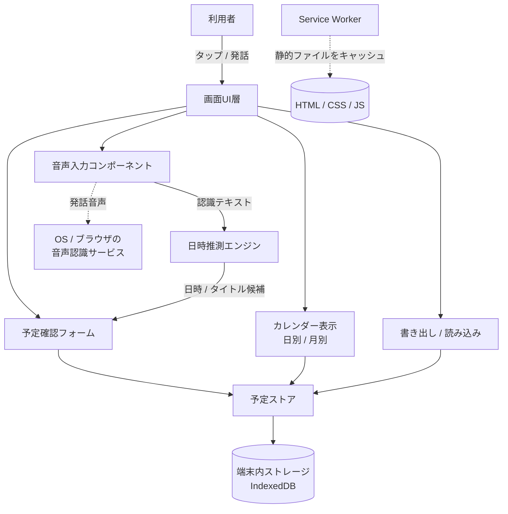
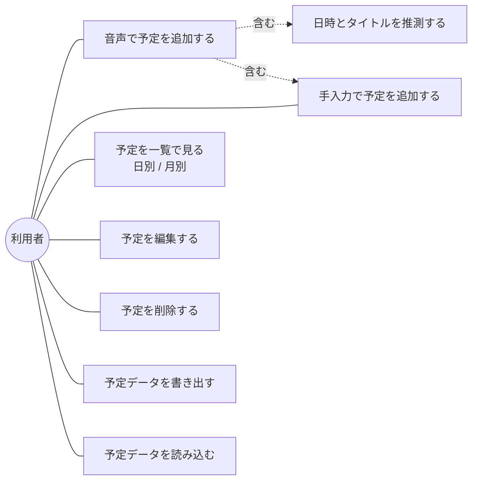
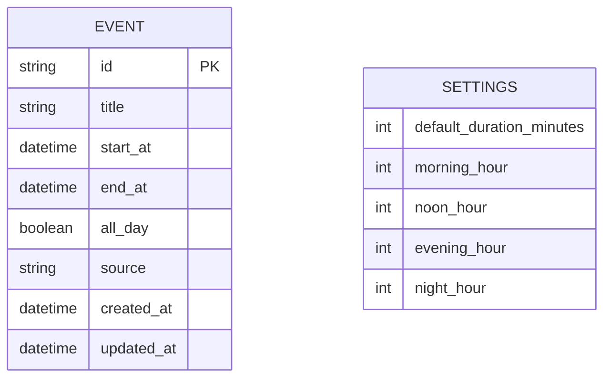
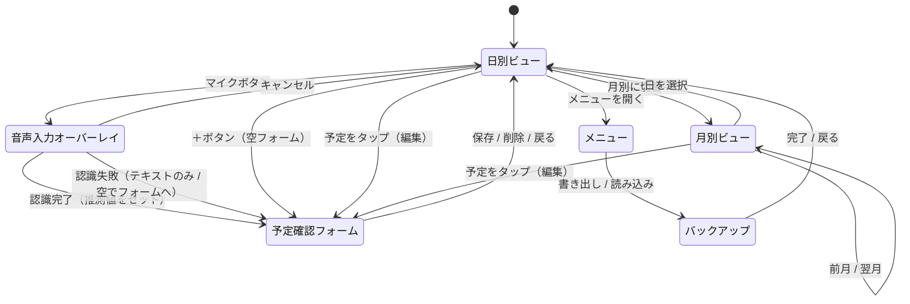
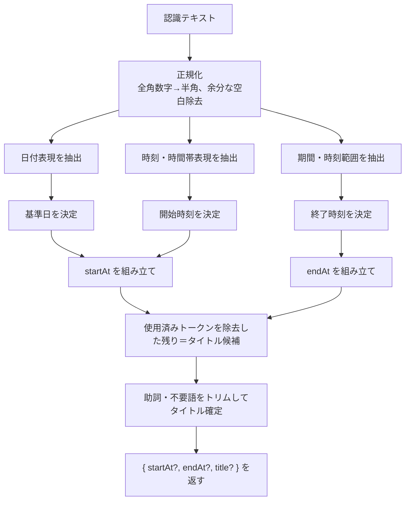
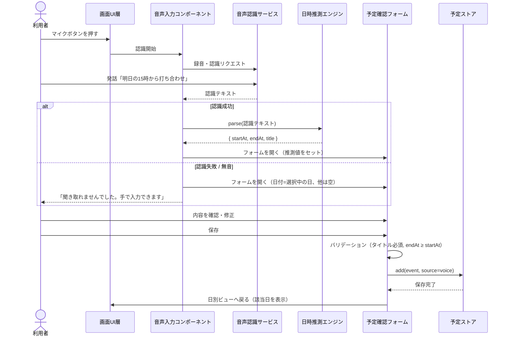
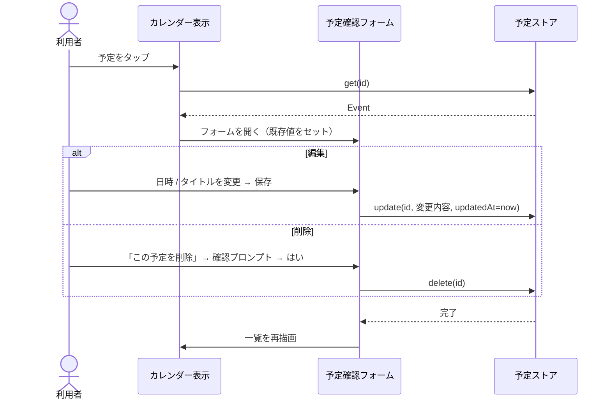
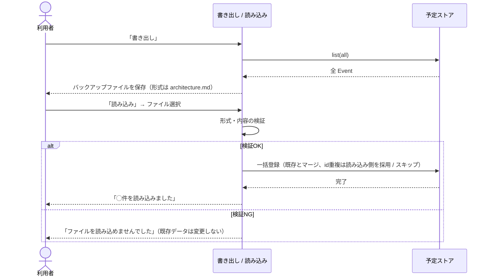

# 機能設計書

本書は `docs/product-requirements.md` のMVPスコープを実現するための機能設計を定義する。要求定義書側で「本書で定義する」とした項目（画面構成、データ構造、日時推測ロジックの詳細）はすべて本書で確定する。音声認識の実現方式・データ保存方式・書き出しファイル形式は `docs/architecture.md` で確定する。

## システム構成図

コエカレはMVPではブラウザ内で完結するクライアントのみのアプリとして構成する。外部サーバーは持たず、予定データは利用者の端末内（ブラウザのストレージ）に保存する。音声認識のときだけ、ブラウザがOS/ブラウザの音声認識サービスへ接続する。



音声認識サービスへの接続は「音声で予定を追加する」操作のときのみ発生し、それ以外の機能（閲覧・手入力・編集・削除・書き出し・読み込み）はすべてオフラインで動作する（`product-requirements.md` の可用性NFRに対応）。

## ユースケース図



「音声で予定を追加する」は、推測結果を確認・修正する段階で「手入力で予定を追加する」と同じフォームを共有する。音声認識または推測に失敗した場合も、フォームは空またはテキストのみ入った状態で開き、行き止まりにならない（`product-requirements.md` 受け入れ条件に対応）。

## データモデル定義

### ER図



MVPのデータは「予定（EVENT）」と「設定（SETTINGS）」の2種のみ。予定どうしの関連（依存・繰り返し・親子）はMVP対象外のため持たない。

### エンティティ定義

**Event（予定）**

| 属性 | 型 | 説明 |
|---|---|---|
| id | string | 予定ID。作成時にUUID（重複しないランダムな文字列）を採番する |
| title | string | 予定のタイトル。空文字は許可しない（保存時にバリデーション） |
| startAt | datetime | 開始日時（ISO 8601形式、端末のタイムゾーン基準） |
| endAt | datetime | 終了日時。開始日時以降であること。省略入力時は `startAt + Settings.defaultDurationMinutes` |
| allDay | boolean | 終日予定なら `true`。`true` のとき時刻部分は無視し、日付のみで扱う |
| source | enum | `voice`（音声から作成）/ `manual`（手入力で作成）。作成後は変更しない。推測精度の振り返り用（`product-requirements.md` の成功指標に対応） |
| createdAt | datetime | 作成日時 |
| updatedAt | datetime | 最終更新日時（編集のたびに更新） |

**Settings（設定）**

| 属性 | 型 | 既定値 | 説明 |
|---|---|---|---|
| defaultDurationMinutes | int | 60 | 終了時刻が指定されなかったときの予定の長さ（分） |
| morningHour | int | 9 | 「朝」と発話されたときに割り当てる時（時刻） |
| noonHour | int | 12 | 「昼」に割り当てる時 |
| eveningHour | int | 17 | 「夕方」に割り当てる時 |
| nightHour | int | 19 | 「夜」に割り当てる時 |

設定はMVPでは画面上に編集UIを設けず、既定値を用いる（`morningHour` 等の調整は将来の設定画面で対応）。ただしデータ構造としては上表を持ち、日時推測エンジンはこの値を参照する（`product-requirements.md` の保守性NFR「対応表現の追加が他へ影響しにくい構造」に対応）。

## 画面構成

### 画面一覧

| 画面 | 役割 | 主な操作 |
|---|---|---|
| 日別ビュー（ホーム） | 起動時に表示。選択日の予定を時系列で一覧 | 日の移動、予定タップで編集、マイクボタン、＋ボタン、月別へ切替、メニュー |
| 月別ビュー | 1か月のカレンダー。予定のある日にマーク | 日タップで日別ビューへ、月の移動 |
| すべての予定（一覧） | 全予定を日付ごとに箇条書きで時系列表示（メニューから開く） | 項目タップで予定確認フォーム（編集）、閉じる |
| 予定確認フォーム | 予定の新規作成・編集。音声追加時は推測値が初期表示される | タイトル・日付・開始/終了時刻・終日の編集、保存、削除（編集時） |
| 音声入力オーバーレイ | マイクボタン押下中に表示。認識中の状態と認識テキストを表示 | 発話、停止、キャンセル |
| メニュー / バックアップ | データの書き出し・読み込み、アプリ情報 | 書き出し実行、ファイル選択して読み込み |

### 画面遷移図



### ワイヤフレーム（日別ビュー）

```
┌─────────────────────────────┐
│  ☰      ‹  8月29日(金)  ›      [月表示] │   ← ヘッダー：メニュー / 日移動 / 月別へ
├─────────────────────────────┤
│  09:00  歯医者                        │
│  ───────────────────────────  │
│  15:00  打ち合わせ（1時間）            │
│  ───────────────────────────  │
│  19:00  夕食 会食                      │
│                                       │
│         （予定がなければ「予定なし」）  │
│                                       │
├─────────────────────────────┤
│                    ＋       (  🎤  )   │   ← ＋：手入力  /  🎤：音声入力（大きめ）
└─────────────────────────────┘
```

### ワイヤフレーム（予定確認フォーム・音声追加時）

```
┌─────────────────────────────┐
│  ✕                        [ 保存 ]     │
├─────────────────────────────┤
│  聞き取った内容：                       │
│  「明日の15時から打ち合わせ」            │
│                                       │
│  タイトル   [ 打ち合わせ            ]  │   ← 推測値。タップで編集
│  日付       [ 2026-08-30 (土)      ]  │
│  終日       [ OFF ]                    │
│  開始       [ 15:00 ]                  │
│  終了       [ 16:00 ]  （既定60分）    │
│                                       │
│  （編集時のみ）        [ この予定を削除 ] │
└─────────────────────────────┘
```

推測できなかった項目は空欄で表示し、プレースホルダーで入力を促す。日付は推測失敗時、日別ビューで選択中の日付を初期値とする。

## 日時推測エンジンの設計

`product-requirements.md` の機能要件で挙げた話し言葉を、`{ startAt?, endAt?, title? }` へ変換する。MVPではルールベース（正規表現による抽出）で実装する。実装ライブラリの採用可否は `architecture.md` で判断する。

### 処理フロー



### 日付表現の対応範囲（MVP）

| 表現 | 解釈 |
|---|---|
| 今日 / 本日 | 実行日 |
| 明日 | 実行日 + 1日 |
| 明後日 / あさって | 実行日 + 2日 |
| 明々後日 / しあさって | 実行日 + 3日 |
| 今週の◯曜（日） | 今週内の該当曜日。すでに過ぎていれば当日扱いにせず次の該当曜日 |
| 来週の◯曜（日） | 翌週の該当曜日 |
| ◯曜（日）のみ | 実行日より後の直近の該当曜日 |
| 今週末 / 週末 | 直近の土曜日 |
| ◯月◯日 | 該当日。過去日付になる場合は翌年の同日 |
| ◯日（日付のみ） | 当月の該当日。すでに過ぎていれば翌月の該当日 |
| （日付表現なし） | 日別ビューで選択中の日付。音声起動直後は実行日 |

### 時刻・時間帯表現の対応範囲（MVP）

| 表現 | 解釈 |
|---|---|
| ◯時 | ◯:00（24時間制。13〜23時はそのまま） |
| ◯時◯分 | ◯:◯ |
| ◯時半 | ◯:30 |
| 午前◯時 | ◯:00（12なら0:00） |
| 午後◯時 / 夕方◯時 | (◯+12):00（12なら12:00） |
| 朝 / 昼 / 夕方 / 夜 | `Settings` の morningHour / noonHour / eveningHour / nightHour |
| （時刻表現なし） | 開始時刻を未設定にし、フォームで入力を促す。終日チェックは付けない |

### 期間・時刻範囲の対応範囲（MVP）

| 表現 | 解釈 |
|---|---|
| ◯時から△時（まで） | startAt=◯時、endAt=△時 |
| ◯時から（終了の指定なし） | startAt=◯時、endAt=startAt + defaultDurationMinutes |
| ◯時間 / ◯時間半 / ◯分 | endAt = startAt + その長さ |
| 終日 / 一日 | allDay=true、時刻は無視 |
| （期間表現なし） | endAt = startAt + defaultDurationMinutes |

### タイトル抽出

- 日付・時刻・期間として消費した文字列を認識テキストから取り除く
- 先頭・末尾の助詞（「に」「から」「の」「は」「で」）と記号をトリムする
- 残りをタイトルとする。空になった場合は `title` を返さず、フォームで入力を促す

### 推測が曖昧なとき

- 複数の日付・時刻候補が取れた場合は、テキストの先頭に近いものを採用する
- どの項目も、フォーム上で利用者が上書きできる。推測はあくまで初期値であり、確定は保存操作で行う（`product-requirements.md` 受け入れ条件「保存前に確認・修正できる」に対応）

## コンポーネント設計

| コンポーネント | 責務 |
|---|---|
| 画面UI層 | 画面の描画とルーティング（日別 / 月別 / フォーム / メニュー）、利用者操作の受付 |
| 音声入力コンポーネント | ブラウザの音声認識の開始・停止・結果取得、認識中の状態表示、失敗時のフォールバック判断（`architecture.md` の音声認識方式に依存） |
| 日時推測エンジン | 認識テキストから `{ startAt?, endAt?, title? }` を算出（ルールベース、`Settings` を参照） |
| 予定確認フォーム | 予定の新規・編集フォーム。バリデーション（タイトル必須、endAt ≥ startAt）、保存・削除の実行 |
| カレンダー表示 | 日別ビュー・月別ビューの描画、予定ストアからの取得と日付での絞り込み |
| 予定ストア | Event の CRUD、端末内ストレージ（IndexedDB）への読み書き、保存失敗時に既存データを保護（`architecture.md` で方式確定） |
| 書き出し / 読み込み | 全 Event のファイル書き出し、ファイルからの復元（形式チェック、既存データを上書きしない検証は `architecture.md` で確定） |
| Service Worker | 静的ファイル（アプリ本体）のキャッシュによるオフライン起動 |

## 主要フローのシーケンス

### 音声で予定を追加する



### 予定を編集・削除する



### データを書き出す / 読み込む



読み込み時の重複ポリシーは **マージ（同一 `id` は読み込み側で上書き、それ以外は追加）** とする。検証に失敗した場合は既存データを一切変更しない（全レコードの検証を通過してから1トランザクションで反映する）。

## API設計

MVPでは外部サーバー・バックエンドAPIを持たないため、HTTP APIの設計対象はない。

将来のクラウド同期・外部カレンダー連携に備え、予定ストアは以下のインターフェースを内部APIとして定義し、実装（IndexedDB版）を差し替え可能にする（`product-requirements.md` の保守性・拡張性NFRに対応）。

| メソッド | 入力 | 出力 | 説明 |
|---|---|---|---|
| `add(event)` | タイトル・日時等（idなし） | 採番済み Event | 予定を1件追加 |
| `update(id, changes)` | ID、変更項目 | 更新後 Event | 予定を1件更新（updatedAt を更新） |
| `delete(id)` | ID | 成否 | 予定を1件削除 |
| `get(id)` | ID | Event / なし | 1件取得 |
| `list(range)` | 期間（開始日〜終了日、または全件） | Event の配列 | 期間内の予定を取得（カレンダー表示・書き出しで使用） |

この抽象の背後にリモート同期実装を追加する場合も、画面UI層・カレンダー表示・フォームのコードは変更しない方針とする。
